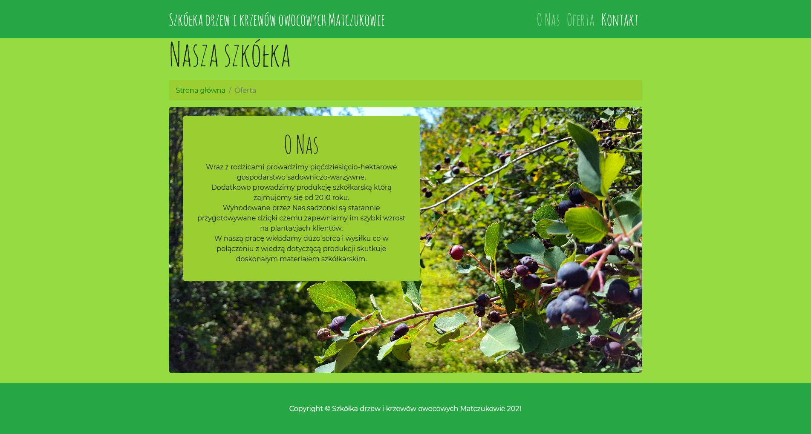
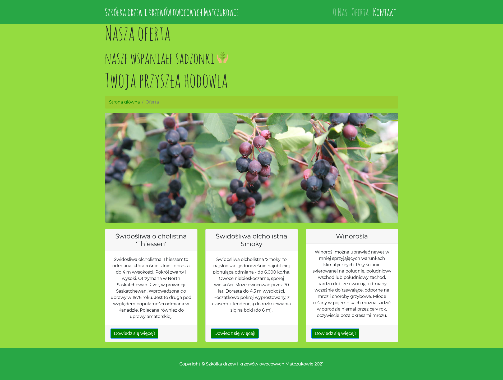
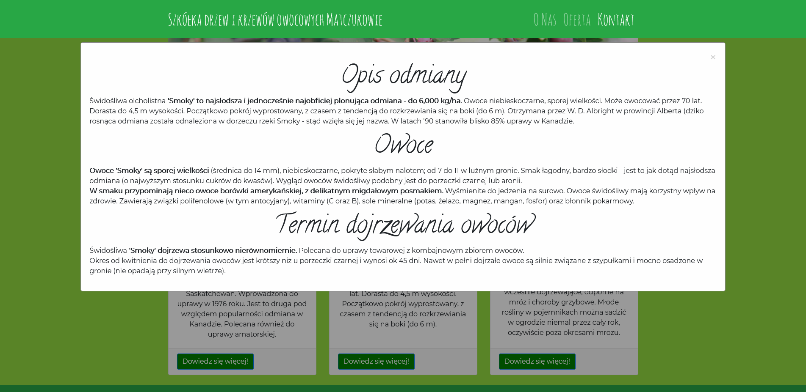
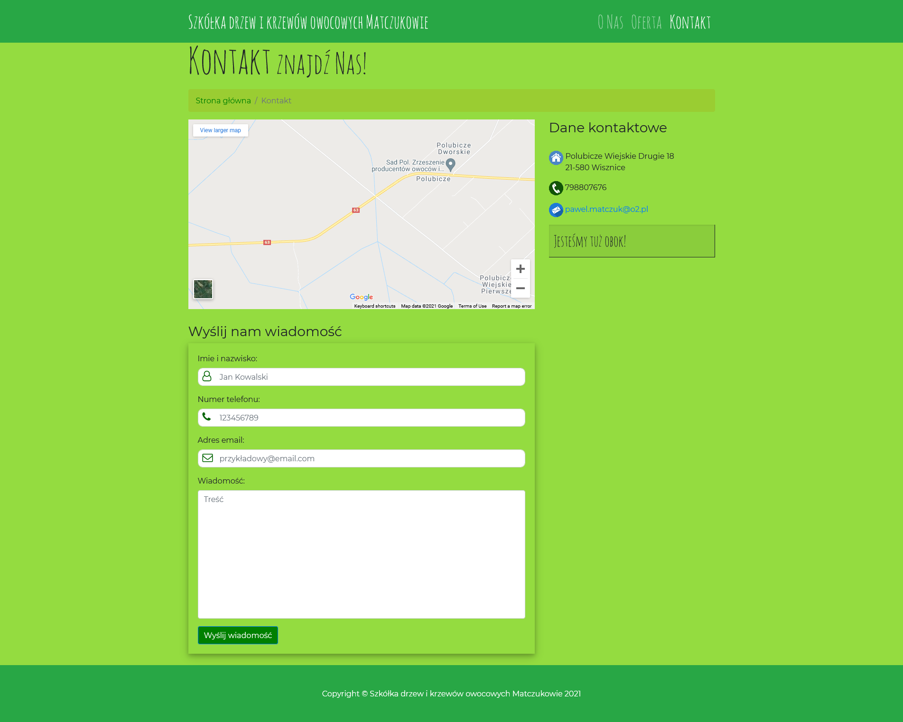

# Saskatoon Site

### Saskatoon berry store website with free components

The goal of this project is to create a website for the saskatoon berry store with only free components.

This project is based on [Saskatoon Site repository](https://github.com/michalkoziara/saskatoon-site).
Additionally, this project provides better user experience and more information about store.

## Technology Stack

* JavaScript
* HTML5 + CSS3

## Preview

<table>
    <tr>
        <td>
            
Homepage

            
        </td>
        <td>
            
About Store

            
        </td>
    </tr>
        <td>
            
Store Offer

            
        </td>
        <td>
            
Product Description

            
        </td>
    </tr>
    </tr>
        <td>
            
Contact & Localization

            
        </td>
    </tr>
</table>

## Author

* **Michał Koziara** 
